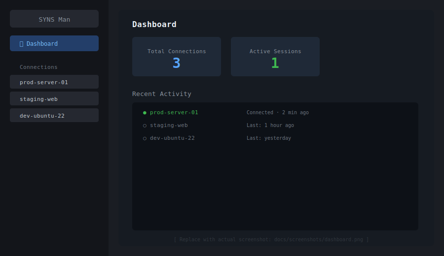
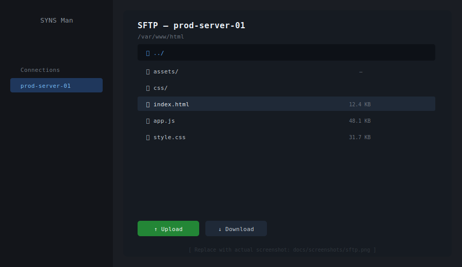
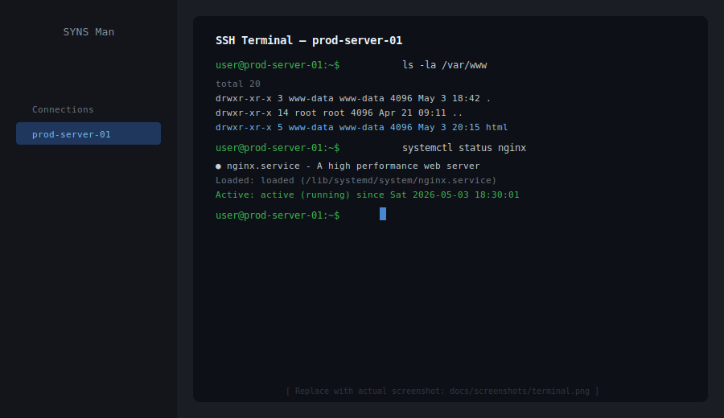

# SYNS Man

<p align="center">
  
</p>

<p align="center">
  <a href="https://github.com/aljailane/syns-man/releases/latest"></a>
  
  
  
</p>

---

## What is SYNS Man?

**SYNS Man** is a lightweight, cross-platform desktop application for managing SSH and SFTP connections. It is built on top of [Electron](https://www.electronjs.org/) and designed to feel fast and minimal — no subscriptions, no cloud sync, everything stays on your machine.

Whether you are a developer deploying code to a remote server, a sysadmin managing multiple Linux machines, or anyone who regularly works over SSH, SYNS Man gives you a clean interface to:

- **Connect to remote servers** with SSH key or password authentication
- **Browse and transfer files** over SFTP without needing a separate client
- **Run terminal commands** in a live SSH session
- **Save connection profiles** locally so you never retype credentials

All credentials are stored in an encrypted local SQLite database — nothing leaves your device.

---

## Screenshots

> Replace the SVG placeholders below with actual `.png` screenshots after first launch.  
> Place them at `docs/screenshots/` with the same filenames.

### Dashboard


### SFTP File Browser


### SSH Terminal


---

## Features

| Feature | Description |
|---------|-------------|
| SSH Terminal | Full interactive SSH session inside the app |
| SFTP Browser | Browse, upload, download, rename, and delete remote files |
| Connection Manager | Save and organize multiple server profiles |
| Secure Storage | Credentials stored in a local encrypted SQLite database |
| Auto-update | Silent background updates on Windows via electron-updater |
| Update Notifications | Banner + toast alerts on Linux and macOS when a new version is available |
| Cross-platform | Runs on Windows (installer/portable), Linux (AppImage/deb/rpm) |

---

## Download

Pre-built binaries are available on the [Releases](https://github.com/aljailane/syns-man/releases) page.

| Platform | File |
|----------|------|
| Windows  | `SYNS-Man-Setup-x.x.x.exe` (installer) or `SYNS-Man-x.x.x.exe` (portable) |
| Linux    | `SYNS-Man-x.x.x.AppImage`, `.deb`, or `.rpm` |

### Linux (AppImage)

```bash
chmod +x SYNS-Man-*.AppImage
./SYNS-Man-*.AppImage
```

### Linux (deb)

```bash
sudo dpkg -i syns_*.deb
```

### Linux (rpm)

```bash
sudo rpm -i syns-*.rpm
```

---

## Development

### Requirements

- [Node.js](https://nodejs.org/) v18 or later
- npm

### Setup

```bash
git clone https://github.com/aljailane/syns-man.git
cd syns-man
npm install
```

### Run

```bash
npm start
```

### Build (local — Linux only)

```bash
# AppImage + deb + rpm
npx electron-builder --linux AppImage deb rpm --x64 --publish never
```

> Windows builds require [Wine](https://www.winehq.org/) on Linux, or run on a Windows machine.

### Release a new version

```bash
# Bump version (patch / minor / major)
npm run release:patch

# Tag and push — GitHub Actions builds and publishes automatically
git add -A
git commit -m "v$(node -p "require('./package.json').version")"
git tag v$(node -p "require('./package.json').version")
git push origin main --tags
```

---

## Tech Stack

- [Electron](https://www.electronjs.org/) v41
- [electron-builder](https://www.electron.build/) — packaging & distribution
- [electron-updater](https://www.electron.build/auto-update) — auto-update (Windows)
- [ssh2](https://github.com/mscdex/ssh2) — SSH & SFTP protocol
- [better-sqlite3](https://github.com/WiseLibs/better-sqlite3) — local database

---

## License

MIT © [aljailane](https://github.com/aljailane)


